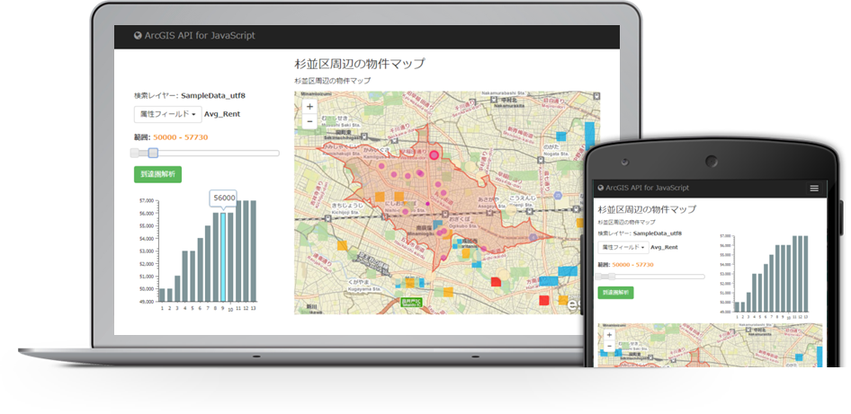

# webmap-startup-template-js

Web マップを使用した開発手法を伝えるためのアプリケーション テンプレートのサンプルです。

[http://esrijapan.github.io/webmap-startup-template-js/](http://esrijapan.github.io/webmap-startup-template-js/)

## 使用している製品・プロジェクト

* [ArcGIS API for JavaScript](https://developers.arcgis.com/javascript/)
* [ArcGIS for Developers](https://developers.arcgis.com/en/)
* [Bootstrap Map JS](https://github.com/esri/bootstrap-map-js/)
* [Dojo Bootstrap](https://github.com/xsokev/Dojo-Bootstrap)
* [Bootstrap](https://github.com/twbs/bootstrap)
* [jQuery](https://github.com/jquery)

**ArcGIS の開発キットを使用して開発を行う場合は ArcGIS Online 開発者アカウント（[ArcGIS for Developers](https://developers.arcgis.com/en/)）が必要です。開発者アカウント作成ガイドは[こちら](http://www.esrij.com/cgi-bin/wp/wp-content/uploads/documents/signup-esri-developers.pdf)**

※到達圏解析は開発者アカウントでのサインインが必要です。解析を一度実行するごとに 0.5 クレジットを消費します。クレジットの詳細は[こちら](http://www.esrij.com/products/arcgis-online-for-developers/details/#plancost)をご参照ください。

## 動作環境

[ArcGIS API for JavaScript](https://developers.arcgis.com/javascript/jshelp/supported_browsers.html)
* Chrome
* Firefox
* Safari
* Internet Explorer 7+

[Bootstrap](http://getbootstrap.com/getting-started/#support)

[jQuery](https://jquery.com/browser-support/)

## リソース

* [GeoNet 開発者コミュニティ サイト](https://geonet.esri.com/groups/devcom-jp)
* [ArcGIS API for JavaScript（ESRIジャパン）](http://www.esrij.com/products/arcgis-api-for-javascript/)
* [ArcGIS API for JavaScript リファレンス](https://developers.arcgis.com/javascript/jsapi/)
* [Bootstrap](http://getbootstrap.com/)
* [jQuery](https://jquery.com/)

## ライセンス
Copyright 2015 Esri Japan Corporation.

Apache License Version 2.0（「本ライセンス」）に基づいてライセンスされます。あなたがこのファイルを使用するためには、本ライセンスに従わなければなりません。本ライセンスのコピーは下記の場所から入手できます。

> http://www.apache.org/licenses/LICENSE-2.0

適用される法律または書面での同意によって命じられない限り、本ライセンスに基づいて頒布されるソフトウェアは、明示黙示を問わず、いかなる保証も条件もなしに「現状のまま」頒布されます。本ライセンスでの権利と制限を規定した文言については、本ライセンスを参照してください。

ライセンスのコピーは本リポジトリの[ライセンス ファイル](./LICENSE)で利用可能です。

